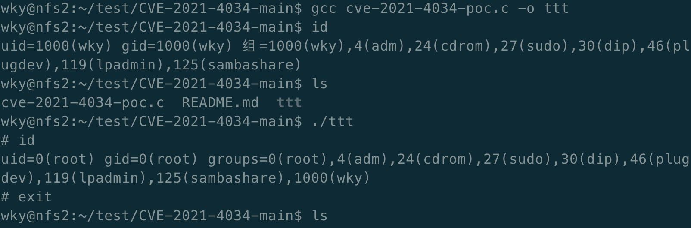
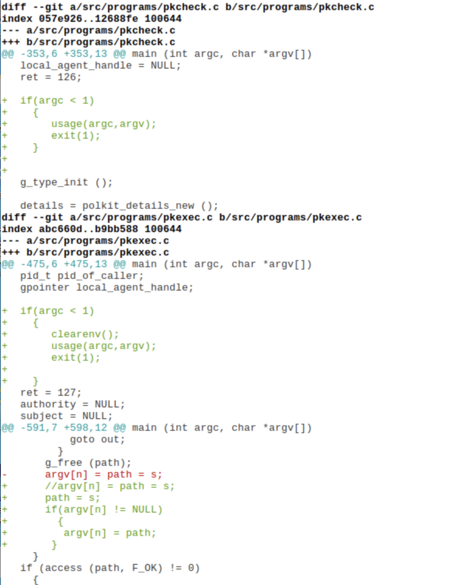

### 发现

公司的安全团队发现国外的Qualys安全团队公布了policykit的提权漏洞CVE-2021-4034，该漏洞可以让任何用户提权为root用户。该漏洞cvss评分为7.8，为高危漏洞。

### 确认

系统默认policykit版本为 0.105-18+1cdos2，存在该漏洞。

### 简介

Polkit是一个应用程序级别的工具集，通过定义和审核权限规则，实现不同优先级进程间的通讯：控制决策集中在统一的框架之中，决定低优先级进程是否有权访问高优先级进程。

Polkit在系统层级进行权限控制，提供了一个低优先级进程和高优先级进程进行通讯的系统。和 sudo 等程序不同，Polkit 并没有赋予进程完全的 root 权限，而是通过一个集中的策略系统进行更精细的授权。

Polkit定义出一系列操作，例如运行 GParted, 并将用户按照群组或用户名进行划分，例如 wheel 群组用户。然后定义每个操作是否可以由某些用户执行，执行操作前是否需要一些额外的确认，例如通过输入密码确认用户是不是属于某个群组。

由于Polkit的 Pkexec工具中存在一处本地权限提升漏洞，致使攻击者可以通过控制环境变量，从而诱导Pkexec执行任意代码。利用成功后，可导致非特权用户获得管理员权限。


### 分析

在Pkexec工具的 main() 函数中，首先会使用如下代码处理所接收的命令行参数：

```
opt_show_help = FALSE;
opt_show_version = FALSE;
opt_disable_internal_agent = FALSE;
for (n = 1; n < (guint) argc; n++)
  {
    if (strcmp (argv[n], "--help") == 0)
      {
        opt_show_help = TRUE;
      }
    else if (strcmp (argv[n], "--version") == 0)
      {
        opt_show_version = TRUE;
      }
    else if (strcmp (argv[n], "--user") == 0 || strcmp (argv[n], "-u") == 0)
      {
        n++;
        if (n >= (guint) argc)
          {
            usage (argc, argv);
            goto out;
          }

        if (opt_user != NULL)
          {
            g_printerr ("--user specified twice\n");
            goto out;
          }
        opt_user = g_strdup (argv[n]);
      }
```

代码将判断传入的参数是否为绝对路径，如果给出非绝对路径，Pkexec工具也将尝试在 path 中定位程序，具体的做法是在PATH 环境变量的目录中搜索要执行的程序。具体的代码如下

```
if (path[0] != '/')
    {
      /* g_find_program_in_path() is not suspectible to attacks via the environment */
      s = g_find_program_in_path (path);
      if (s == NULL)
        {
          g_printerr ("Cannot run program %s: %s\n", path, strerror (ENOENT));
          goto out;
        }
      g_free (path);
      argv[n] = path = s;
    }
```

如果命令行参数argc的数量为 0，这意味着如果传递给execve()的参数列表 argv为空，那么 argv[0]将为 NULL，是参数列表的终止符，这将导致：

Pkexec代码中，整数 n 设置为 1；

```
for (n = 1; n < (guint) argc; n++)
```

从 argv[1] 越界读取指针路径；

```
path = g_strdup (argv[n]);
```

指针 s 被越界写入argv[1] ；

```
argv[n] = path = s;
```

由于argv和envp 指针在内存中是连续的，如果 argc 为 0，那么越界argv[1] 实际上是 envp[0]，即为指向我们的第一个环境变量“value”的指针。最终导致：

将要执行的程序的路径从argv[1]（即envp[0]）中越界读取，并指向“value”；

由于“value”不是以斜线开头，因此将这个 “value”传递给 g_find_program_in_path()

随后，g_find_program_in_path() 在PATH 环境变量目录中搜索一个名为“value”的可执行文件。如果找到这样的可执行文件，则将其完整路径返回给 pkexec的 main() 函数。

最后，这个完整路径被越界写入 argv[1]（即 envp[0]），从而覆盖了我们的第一个环境变量。

### 复现方法

已提供poc，复现方式如图



### 修复方案

此漏洞影响范围很大，policykit维护团队很快就公布了修复补丁，修复方案为将上游补丁打到我们的包上。

### 修复补丁

修复补丁如下图



### 测试

经过测试，修复完成之后已经无法复现该漏洞。