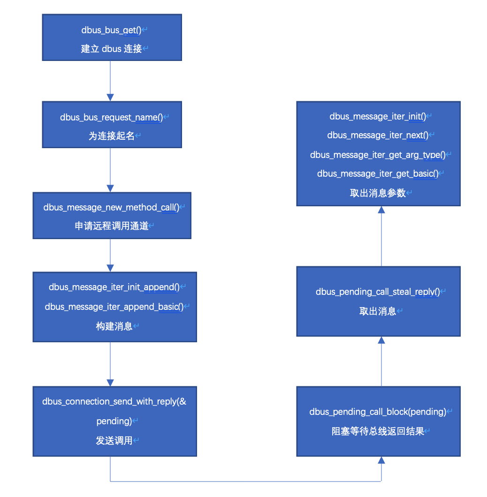

title: dbus方案
date: 2022-02-15 14:56:21
tags:

- dbus

## dbus替代系统内使用sudo nopasswd机制取得root权限方案

现在我们系统内一些在普通用户下需要无密码root权限的操作，是通过给对应的脚本或者程序sudo的NOPASSWD权限来实现的，这种实现方式存在很大的安全隐患，如果被配置了sudo的NOPASSWD的脚本被恶意篡改，那将会有很大的安全隐患。

### python demo

以应用商城的安装脚本为例子

```
/usr/share/cdos-softcenter/apt-get-bash.py
```

脚本中很多步骤是不需要root权限的，需要的只有 install、remove、update、upgrade等操作，我们可以使用dbus的机制把这一部分操作摘取出来，放到一个服务中去，而其他的操作只给予普通用户权限。

针对这个我写了一个使用dbus替代的验证demo

在server端里添加一个回调函数 Test

```
class SomeObject(dbus.service.Object):

    @dbus.service.method("com.example.SampleInterface",
                         in_signature='s', out_signature='as')
    def Test(self, hello_message):
        print("service:", str(hello_message))
        cmd="apt " + hello_message + " -y"
        ret=subprocess.getoutput(cmd)

        return [ret, "with unique name",
                session_bus.get_unique_name()]
```

在client端发送method call来调用server的中的函数

```
try:
        remote_object = bus.get_object("com.example.SampleService",
                                       "/SomeObject")

        # you can either specify the dbus_interface in each call...
        hello_reply_list = remote_object.Test(cmd,
            dbus_interface = "com.example.SampleInterface")
```

使用root用户执行

```
python3 service.py
```

普通用户执行

```
 python3 client.py remove d-feet -y
```

得到执行服务端返回的执行结果

```
client:
WARNING: apt does not have a stable CLI interface. Use with caution in scripts.

正在读取软件包列表...
正在分析软件包的依赖关系树...
正在读取状态信息...
下列软件包将被【卸载】：
  d-feet
升级了 0 个软件包，新安装了 0 个软件包，要卸载 1 个软件包，有 154 个软件包未被升级。
解压缩后将会空出 597 kB 的空间。
(正在读取数据库 ...
(正在读取数据库 ... 5%
(正在读取数据库 ... 10%
(正在读取数据库 ... 15%
(正在读取数据库 ... 20%
(正在读取数据库 ... 25%
(正在读取数据库 ... 30%
(正在读取数据库 ... 35%
(正在读取数据库 ... 40%
(正在读取数据库 ... 45%
(正在读取数据库 ... 50%
(正在读取数据库 ... 55%
(正在读取数据库 ... 60%
(正在读取数据库 ... 65%
(正在读取数据库 ... 70%
(正在读取数据库 ... 75%
(正在读取数据库 ... 80%
(正在读取数据库 ... 85%
(正在读取数据库 ... 90%
(正在读取数据库 ... 95%
(正在读取数据库 ... 100%
(正在读取数据库 ... 系统当前共安装有 200005 个文件和目录。)
正在卸载 d-feet (0.3.14-1) ...
正在处理用于 mime-support (3.62) 的触发器 ...
正在处理用于 hicolor-icon-theme (0.17-2) 的触发器 ...
正在处理用于 libglib2.0-0:amd64 (2.58.3-2+deb10u3+nfs4) 的触发器 ...
正在处理用于 man-db (2.8.5-2) 的触发器 ...
正在处理用于 desktop-file-utils (0.23-4) 的触发器 ...
```

### C Qt demo

针对不同的情况我还写了c的dbus的demo和qt的dbus的demo

c的dbus常用接口可以看dbus-c.md,使用方法可以看demo里的代码

服务端的代码可以看 dbus_receive()函数

发送端可以看dbus_send_signal()和dbus_send_method_call(),一个是发送signal，一个是发送method call请求，c的demo中，method call函数是将接收到的数据再原路返回。

c demo用法

root用户执行

```
./demo receive
```

普通用户执行

```
./demo send SIGNAL STRING hello
./demo send METHOD INT32 99
```

第一个发送signal ，发送数据类型为string，数据为hello，没有返回值

第二个是发送method call，数据类型为int，数据为99

在使用c的基础上又写了qt的demo

callback按钮为发送method call，在第一个输入框内输入字符，发送给服务端，接收返回结果在第二个框内显示，send为发送signal，这个可以使用c demo来作为服务端。


### dbus api 使用流程图

下面流程图为服务端处理method call的流程


下面流程图为服务端处理信号的流程


下面流程图为客户端发送函数调用的流程


下面流程图为客户端发送信号的流程图


