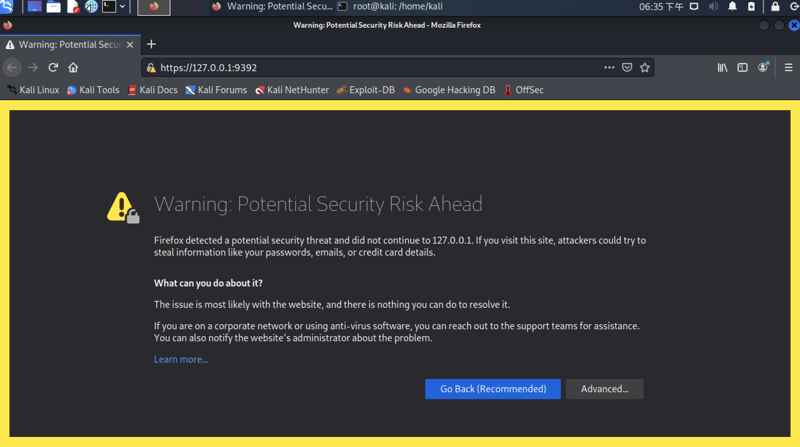
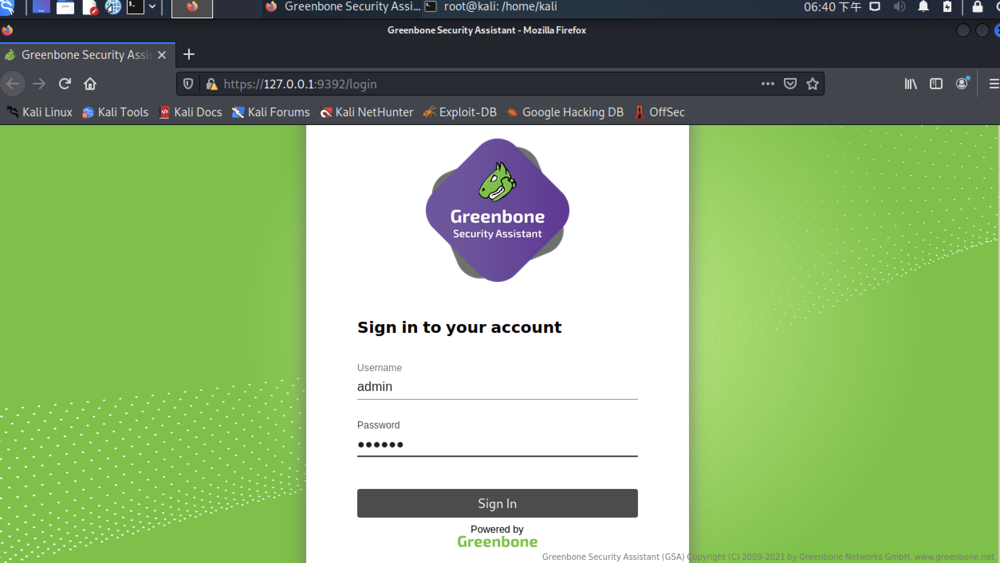
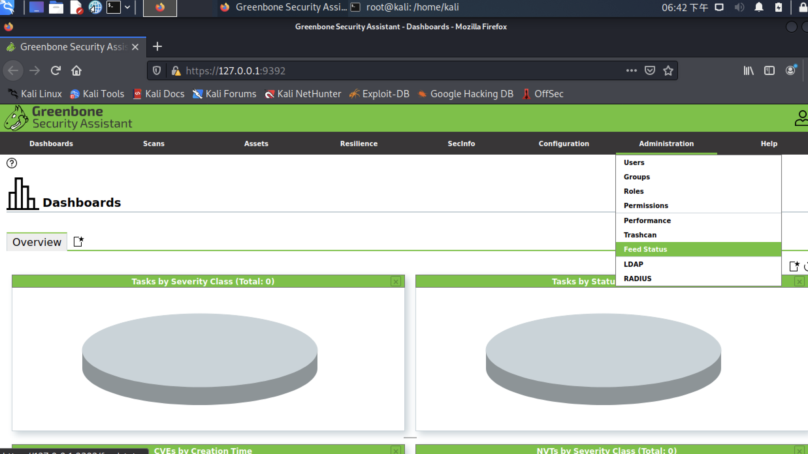

此文档是在安装完gvm组件的kali系统上离线完成gvm初始化的操作文档

# 首先要先把gvm组件安装好（这一步如果需要，可以之后可以修改成将必要的包下载到本地来安装）

先修改 /etc/apt/sources.list ，将kali源更换一下，如果默认是这个源就不用换
```
deb http://mirrors.ustc.edu.cn/kali kali-rolling main non-free contrib
deb-src http://mirrors.ustc.edu.cn/kali kali-rolling main non-free contrib
```
执行下面命令将gvm相关的组建安装好
```
┌──(root💀kali)-[/home/kali]
└─# apt update
└─# apt install gvm*
```
安装完可以查看下gvm的安装版本
```
┌──(root💀kali)-[/home/kali]
└─# gvmd --version                                                    127 ⨯
Greenbone Vulnerability Manager 21.4.4
Manager DB revision 242
Copyright (C) 2009-2021 Greenbone Networks GmbH
License: AGPL-3.0-or-later
This is free software: you are free to change and redistribute it.
There is NO WARRANTY, to the extent permitted by law.
```

# 断网初始化gvm
如果是联网的环境，可以直接执行下面命令开始进行gvm的初始化流程
```
┌──(root💀kali)-[/home/kali]
└─# gvm-setup
```
## 检查postgreSql的版本
在安装过程成，可能会遇到系统里有两个版本PostgreSQL的情况
最新版本的gvm需要14版本的postgresql数据库，如果系统里默认的主版本是13版本，就需要修改一下
### 先查看系统里的PostgreSQL版本

```
┌──(root💀kali)-[/home/kali]
└─# pg_lsclusters
Ver Cluster Port Status Owner    Data directory              Log file
13  main    5432 down   postgres /var/lib/postgresql/13/main /var/log/postgresql/postgresql-13-main.log
14  main    5433 down   postgres /var/lib/postgresql/14/main /var/log/postgresql/postgresql-14-main.log
```

### 删除13版本的PostgreSQL 
```
┌──(root💀kali)-[/home/kali]
└─# pg_dropcluster --stop 13 main
```
### 将14设置为主要版本
```
┌──(root💀kali)-[/home/kali]
└─# pg_upgradecluster 14 main
```
然后把14版本的PostgreSQL监听端口修改成5432

修改/etc/postgresql/14/main/postgresql.conf ，将其中的port = 修改为5432
```
port = 5432                             # (change requires restart)
max_connections = 100                   # (change requires restart)
#superuser_reserved_connections = 3     # (change requires restart)
unix_socket_directories = '/var/run/postgresql' # comma-separated list of directories
```

## 解压初始化脚本包
我已经将修改过的初始化脚本和备份好的数据库文件打包成init_gvm.tar.gz包
### 解压压缩包
```
┌──(root💀kali)-[/home/kali]
└─# tar -xzvf init_gvm.tar.gz
init_gvm/
init_gvm/init.sh
init_gvm/greenbone-feed-sync
init_gvm/plugins.tar.gz
init_gvm/greenbone-nvt-sync
init_gvm/gvm.tar.gz
```
### 进入到init_gvm目录，执行init脚本
```
┌──(root💀kali)-[/home/kali/init_gvm]
└─# sudo sh init.sh
```
### 执行gvm-setup并等待初始化完成
```
┌──(root💀kali)-[/home/kali/init_gvm]
└─# gvm-setup
```
### 执行gvm-check-setup检查初始化是否成功
```
┌──(root💀kali)-[/home/kali/init_gvm]
└─# gvm-check-setup
gvm-check-setup 21.4.3
  Test completeness and readiness of GVM-21.4.3
Step 1: Checking OpenVAS (Scanner)...
        OK: OpenVAS Scanner is present in version 21.4.3.
        OK: Server CA Certificate is present as /var/lib/gvm/CA/servercert.pem.
Checking permissions of /var/lib/openvas/gnupg/*
        OK: _gvm owns all files in /var/lib/openvas/gnupg
        OK: redis-server is present.
        OK: scanner (db_address setting) is configured properly using the redis-server socket: /var/run/redis-openvas/redis-server.sock
        OK: redis-server is running and listening on socket: /var/run/redis-openvas/redis-server.sock.
        OK: redis-server configuration is OK and redis-server is running.
        OK: _gvm owns all files in /var/lib/openvas/plugins
        OK: NVT collection in /var/lib/openvas/plugins contains 77525 NVTs.
Checking that the obsolete redis database has been removed
        OK: No old Redis DB
        OK: ospd-OpenVAS is present in version 21.4.3.
Step 2: Checking GVMD Manager ...
        OK: GVM Manager (gvmd) is present in version 21.4.4.
Step 3: Checking Certificates ...
        OK: GVM client certificate is valid and present as /var/lib/gvm/CA/clientcert.pem.
        OK: Your GVM certificate infrastructure passed validation.
Step 4: Checking data ...
        OK: SCAP data found in /var/lib/gvm/scap-data.
        OK: CERT data found in /var/lib/gvm/cert-data.
Step 5: Checking Postgresql DB and user ...
        OK: Postgresql version and default port are OK.
 gvmd      | _gvm     | UTF8     | zh_CN.UTF-8 | zh_CN.UTF-8 |
        OK: At least one user exists.
Step 6: Checking Greenbone Security Assistant (GSA) ...
Oops, secure memory pool already initialized
        OK: Greenbone Security Assistant is present in version 21.4.3.
Step 7: Checking if GVM services are up and running ...
        Starting ospd-openvas service
        Waiting for ospd-openvas service
        OK: ospd-openvas service is active.
        Starting gvmd service
        Waiting for gvmd service
        OK: gvmd service is active.
        Starting greenbone-security-assistant service
        Waiting for greenbone-security-assistant service
        OK: greenbone-security-assistant service is active.
Step 8: Checking few other requirements...
        OK: nmap is present in version 21.4.3.
        OK: ssh-keygen found, LSC credential generation for GNU/Linux targets is likely to work.
        WARNING: Could not find makensis binary, LSC credential package generation for Microsoft Windows targets will not work.
        SUGGEST: Install nsis.
        OK: xsltproc found.
        WARNING: Your password policy is empty.
        SUGGEST: Edit the /etc/gvm/pwpolicy.conf file to set a password policy.

It seems like your GVM-21.4.3 installation is OK.
```
显示如上结果则表明初始化过程成功完成
然后重启下gvm的服务
```
┌──(root💀kali)-[/home/kali/init_gvm]
└─# gvm-stop
┌──(root💀kali)-[/home/kali/init_gvm]
└─# gvm-start                                                           3 ⨯
[>] Please wait for the GVM services to start.
[>]
[>] You might need to refresh your browser once it opens.
[>]
[>]  Web UI (Greenbone Security Assistant): https://127.0.0.1:9392

● greenbone-security-assistant.service - Greenbone Security Assistant (gsad)
     Loaded: loaded (/lib/systemd/system/greenbone-security-assistant.service; disabled; vendor preset: disabled)
     Active: active (running) since Tue 2021-11-30 18:30:45 CST; 9ms ago
       Docs: man:gsad(8)
             https://www.greenbone.net
    Process: 6970 ExecStart=/usr/sbin/gsad --listen=127.0.0.1 --port=9392 (code=exited, status=0/SUCCESS)
   Main PID: 6971 (gsad)
      Tasks: 3 (limit: 4578)
     Memory: 2.1M
        CPU: 15ms
     CGroup: /system.slice/greenbone-security-assistant.service
             ├─6971 /usr/sbin/gsad --listen=127.0.0.1 --port=9392
             └─6972 /usr/sbin/gsad --listen=127.0.0.1 --port=9392

11月 30 18:30:45 kali systemd[1]: Starting Greenbone Security Assistant (gsad)...
11月 30 18:30:45 kali gsad[6970]: Oops, secure memory pool already initialized
11月 30 18:30:45 kali systemd[1]: Started Greenbone Security Assistant (gsad).

● gvmd.service - Greenbone Vulnerability Manager daemon (gvmd)
     Loaded: loaded (/lib/systemd/system/gvmd.service; disabled; vendor preset: disabled)
     Active: active (running) since Tue 2021-11-30 18:30:40 CST; 5s ago
       Docs: man:gvmd(8)
    Process: 6939 ExecStart=/usr/sbin/gvmd --osp-vt-update=/run/ospd/ospd.sock --listen-group=_gvm (code=exited, status=0/SUCCESS)
   Main PID: 6945 (gvmd)
      Tasks: 1 (limit: 4578)
     Memory: 5.2M
        CPU: 63ms
     CGroup: /system.slice/gvmd.service
             └─6945 "gvmd: Waiting for incoming connections" "" "" "" "" "" "" "" "" "" "" "" "" "" "" "" "" "" "" "" "" "" "" "" "" "" "" "" "" "" "" "" ""

11月 30 18:30:39 kali systemd[1]: Starting Greenbone Vulnerability Manager daemon (gvmd)...
11月 30 18:30:39 kali systemd[1]: gvmd.service: Can't open PID file /run/gvm/gvmd.pid (yet?) after start: Operation not permitted
11月 30 18:30:40 kali systemd[1]: Started Greenbone Vulnerability Manager daemon (gvmd).

● ospd-openvas.service - OSPd Wrapper for the OpenVAS Scanner (ospd-openvas)
     Loaded: loaded (/lib/systemd/system/ospd-openvas.service; disabled; vendor preset: disabled)
     Active: active (running) since Tue 2021-11-30 18:30:39 CST; 5s ago
       Docs: man:ospd-openvas(8)
             man:openvas(8)
    Process: 6935 ExecStart=/usr/bin/ospd-openvas --config /etc/gvm/ospd-openvas.conf --log-config /etc/gvm/ospd-logging.conf --unix-socket /run/ospd/ospd.sock --pid-file /run/ospd/ospd-openvas.pid --log-file /var/log/gvm/ospd-openvas.log --lock-file-dir /var/lib/openvas (code=exited, status=0/SUCCESS)
   Main PID: 6937 (ospd-openvas)
      Tasks: 4 (limit: 4578)
     Memory: 24.0M
        CPU: 199ms
     CGroup: /system.slice/ospd-openvas.service
             ├─6937 /usr/bin/python3 /usr/bin/ospd-openvas --config /etc/gvm/ospd-openvas.conf --log-config /etc/gvm/ospd-logging.conf --unix-socket /run/ospd/ospd.sock --pid-file /run/ospd/ospd-openvas.pid --log-file /var/log/gvm/ospd-openvas.log --lock-file-dir /var/lib/openvas
             └─6940 /usr/bin/python3 /usr/bin/ospd-openvas --config /etc/gvm/ospd-openvas.conf --log-config /etc/gvm/ospd-logging.conf --unix-socket /run/ospd/ospd.sock --pid-file /run/ospd/ospd-openvas.pid --log-file /var/log/gvm/ospd-openvas.log --lock-file-dir /var/lib/openvas

11月 30 18:30:39 kali systemd[1]: Starting OSPd Wrapper for the OpenVAS Scanner (ospd-openvas)...
11月 30 18:30:39 kali systemd[1]: Started OSPd Wrapper for the OpenVAS Scanner (ospd-openvas).

[>] Opening Web UI (https://127.0.0.1:9392) in: 5... 4... 3... 2... 1...
```
### 设置用户名和密码

```
┌──(root💀kali)-[/home/kali/init_gvm]
└─# runuser -u _gvm -- gvmd --user=admin --new-password=abc123
```

## gvm 使用
打开浏览器，输入127.0.0.1:9392 如图，点击advanced,然后再点击 Accept the Risk and Continue


输入刚才设置的用户名密码


在Administration栏中选择feed status

等SCAP CERT GVMD_DATA的Status项从updating...的状态变为 xx days之后，就可以正常使用gvm来进行漏洞扫描了。

# 更新数据库

## 联网机器

联网的机器更新更新漏洞数据库只需要执行下面命令即可

```
┌──(root💀kali)-[/home/wky]
└─# gvm-feed-update
```


## 断网机器更新

断网机器更新需要先将更新好的机器中数据库文件整体打包出来

```
┌──(root💀kali)-[/var/lib/openvas]
└─# tar -czvf ~/plugins.tar.gz /var/lib/openvas/plugins
┌──(root💀kali)-[/var/lib]
└─# tar -czvf ~/gvm.tar.gz /var/lib/gvm
```

将打包好的plugins.tar.gz 和gvm.tar.gz拿到断网机器上并复制到 /tmp目录下

然后再执行

```
┌──(root💀kali)-[/home/wky]
└─# gvm-feed-update
```

即可，因为断网的更新脚本已经被修改过了，会在/tmp下寻找数据库的压缩包来更新数据库
